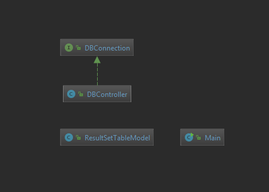

# Car Rental GUI Database
<b>Overview</b> 
  JavaFX program for maintaining a car rental database. The user can access data from the program.

--GIF OF PROGRAM

<b>Project Requirements</b> 
- Use JavaFX 
- Use a database 
- No SpotBugs errors 
- No CheckStyle errors 
- Extensive inline documentation 
- A README explaining the project 

<b>Project Diagram</b> 

<b>Table Details</b> 

<b>Customers Table</b> 
  The customer table holds all customer data that the company collects. This includes the fields customer_id, firstName, lastName, and country_of_residence. Customer_id is the primary key and best way to identify customers. The next columns are the customer's first name, last name, and country of residence.
  
<b>Fleet Table</b> 
  The fleet table holds all vehicle data that the company collects. This includes the fields vehicle_id, vehicle_make, vehicle_model, vehicle_group, and vehicle_miles. Vehicle_id is the primary key and best way to identify vehicles. The next columns are the vehicle's make, model, group, and miles.
  
<b>Location Table</b> 
  The location table holds all location data that the company collects. This includes the fields location_id, location_name, and address. Location_id is the primary key and best way to identify locations. The next columns are the location's name and address.

<b>Employees Table</b> 
  The employee table holds all employee data that the company collects. This includes the fields employee_id, firstName, lastName, and country_of_residence. Employee_id is the primary key and best way to identify employees. The next columns are the employee's first name, last name, and country of residence.
  
<b>Rentals Table</b> 
  The rentals table holds all rental data that the company collects. This includes the fields rental_id, customer_id, vehicle_id, employee_id, location_id,revenue, insurance_purchase, and insurance_revenue. Rental_id is the primary key and best way to identify rentals. Fields customer_id, vehicle_id, employee_id, and location_id are foreign keys to the respective tables. The revenue column contains the rental's revenue. Insurance purchase can be Y or N to indicate if insurance was purchased. If insurance was purchased, insurance revenue will show the revenue associated with that rental.
